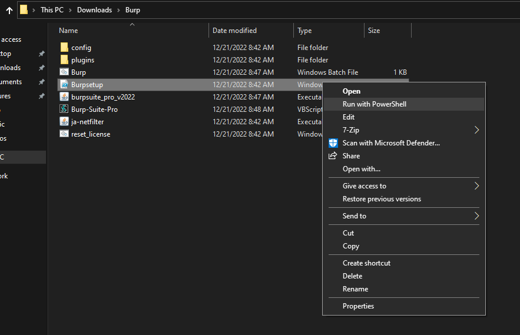
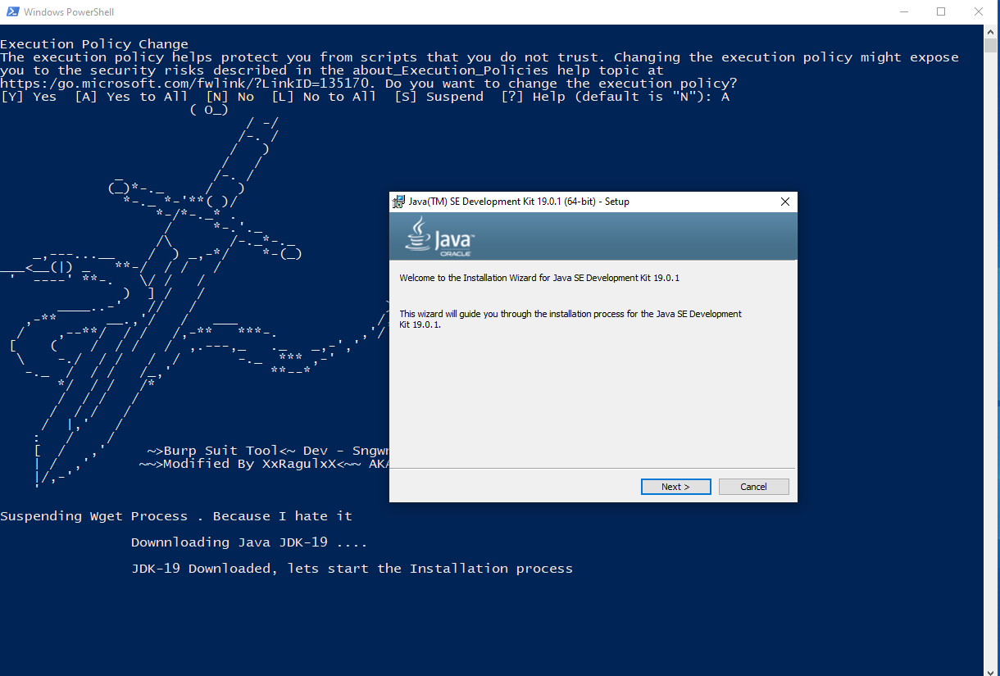
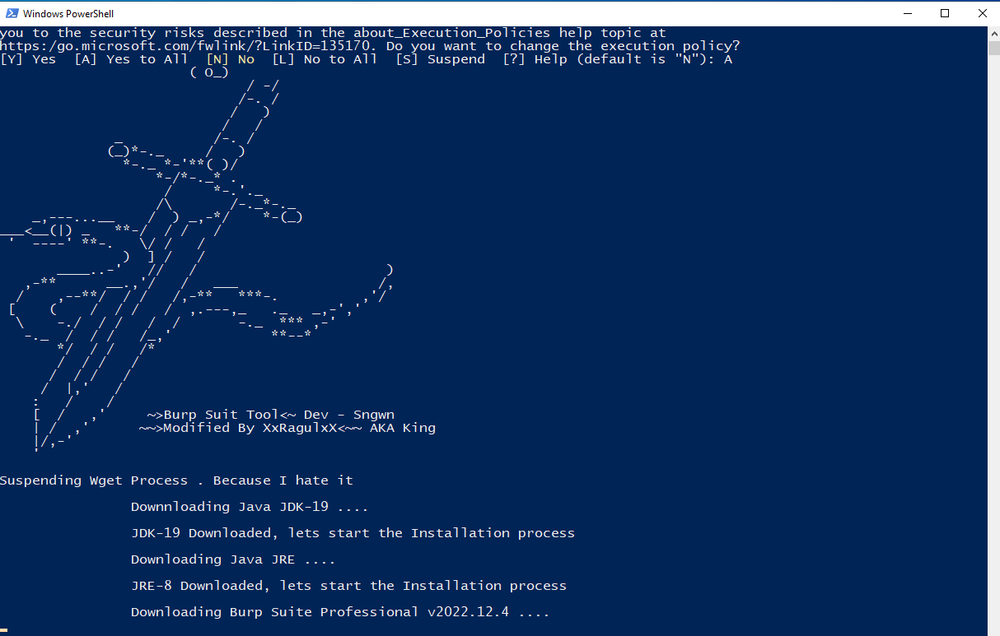
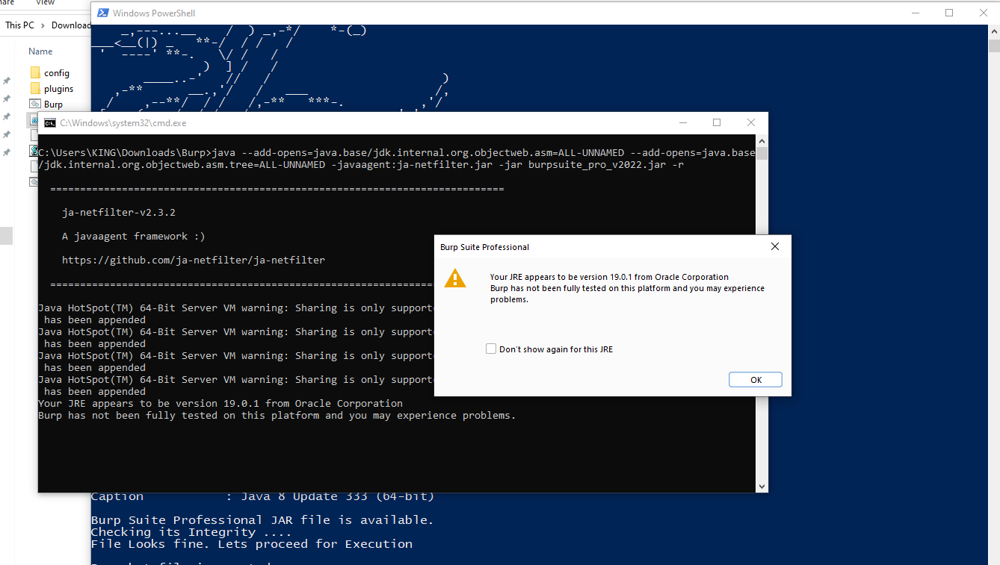
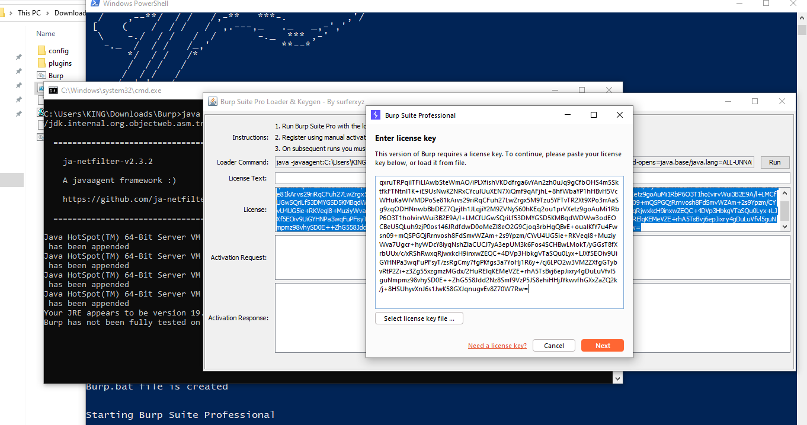
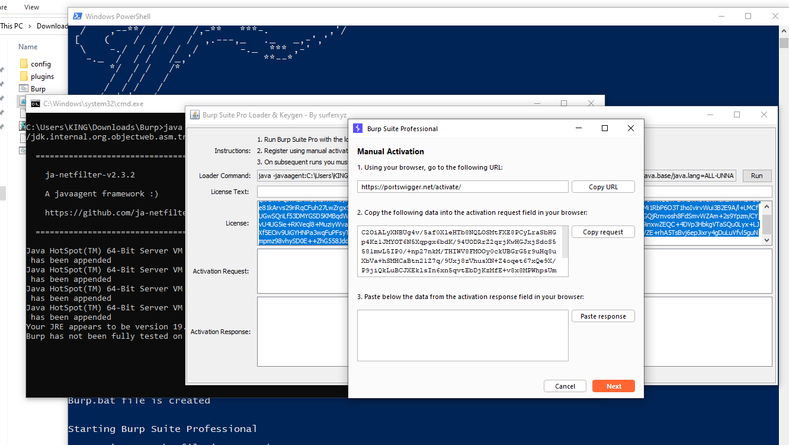
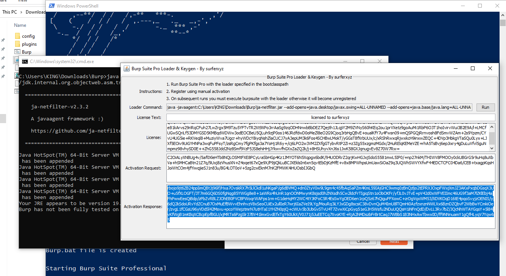
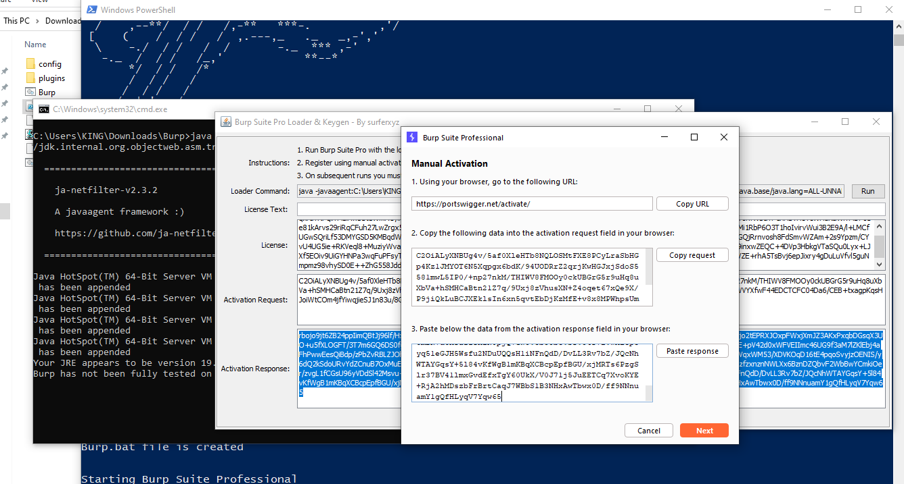
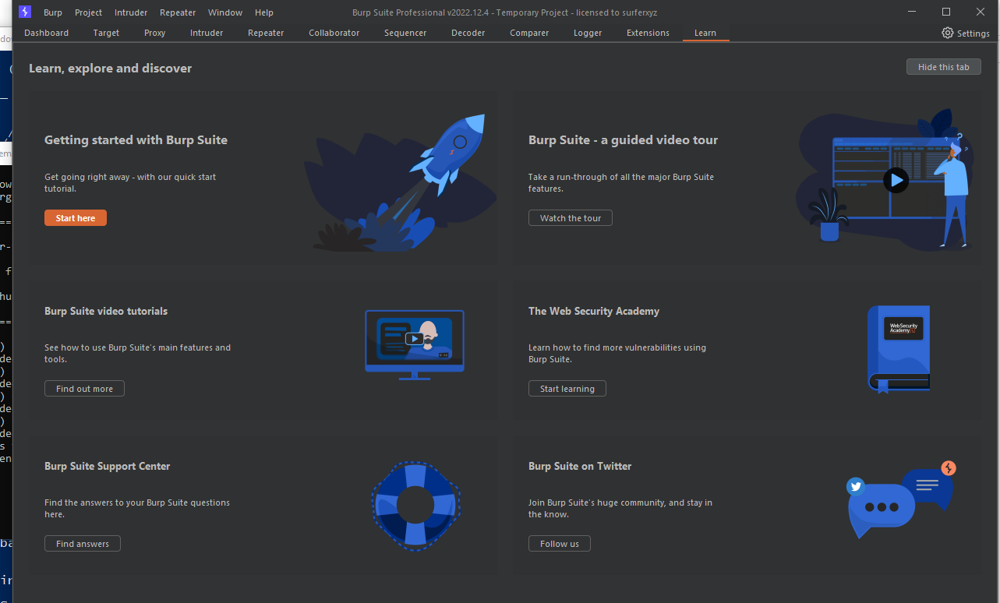
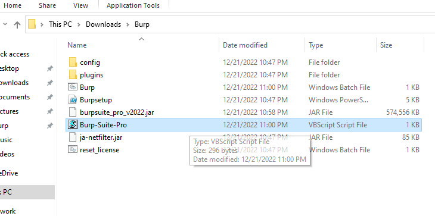

# Burp Suite Professional Edition 

V2022.12.4 [latest patch notes](https://portswigger.net/burp/releases/professional-community-2022-12-4)

Credits - Sngwn surferxyz for activator .  

How to use ? 

Error : Set-ExecutionPolicy -Scope Process -ExecutionPolicy Bypass

Set-ExecutionPolicy Unrestricted

Step - 1 : Download the file from [here](https://github.com/XxRagulxX/Burpsuite_pro/releases/tag/Build) 

Step - 2 : Use 7-zip to Unzip the file. If you don't have [7-zip offical download](https://www.7-zip.org/download.html) 

Step - 3 : Run Burpsetup.ps1 (Powershell file) . Right click the file and Run with Powershell 

Step - 4 : Accept the terms and conditions (A) . After that Just follow the installation for basic installation . 

Step - 5 : It will check for java, and install it . 

Step - 6 : Burp will be automatically downloaded . Just be patient until the download is complete . 

Step - 7 : Once the download is complete, It will automatically get opened . (Note: If burp not opening automatically then kindly close all the applications and run the Powershell script again and it should fix the issue)

Step - 8 : Accept the EULA and precede further . 

Step - 9 : Copy the license from the Brup suite pro loader & keygen and paste it in "Enter License key" 

Step - 10 : Click next , Select Manual Activation . Copy the request from the box and paste it in Activation Request (Brup suite pro loader & keygen) . 

Step - 11 : Copy the Activation Response and paste it back in burp activation.

Step - 12 : Click Next , Click finish . 

Step - 13 : After everything is completed, close the burp suite and open the visualbasic script (It will directly open burpsuite)

