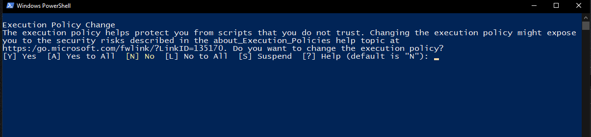

# Burp Suite Professional Edition 

V2022.12.4 (latest)

How to use ? 

Step - 1 : Download the file from [here](https://github.com/XxRagulxX/Burpsuite_pro/releases/tag/Build) 

Step - 2 : Use 7-zip to Unzip the file. If you don't have [7-zip offical download](https://www.7-zip.org/download.html) 

Step - 3 : Run Burpsetup.ps1 (Powershell file) . Right click the file and Run with Powershell 

Step - 4 : Accept the terms and conditions (A) . After that Just follow the installation for basic installation . 

